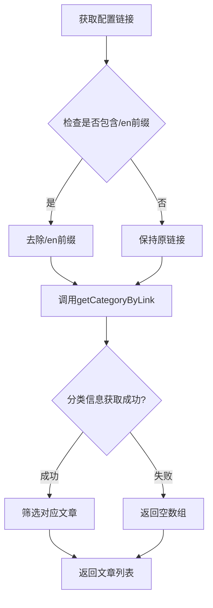
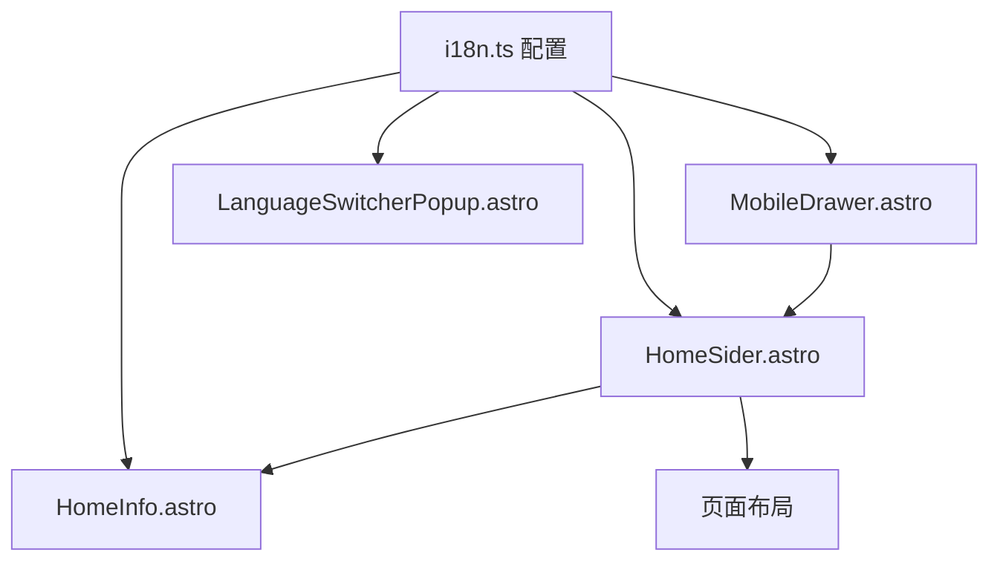

# SilentXx 博客项目技术文档 (v0.21)

## 📋 v0.21.8 更新日志 (2025-09-17) - Featured Categories 图片显示和文章筛选问题修复

### 🚨 问题描述

#### 问题现象

用户反馈首页 Featured Categories 功能存在两个严重问题：

**问题 1：中文版精选分类不显示默认图片** ❌

- 现象：中文版首页所有精选分类卡片都无法显示背景图片
- 影响：视觉效果差，用户体验不佳
- 范围：所有中文版精选分类

**问题 2：英文版 Featured Categories 不显示文章** ❌

- 现象：英文版首页精选分类显示 "0 articles"
- 影响：用户无法看到英文版内容，功能完全失效
- 范围：所有英文版精选分类

#### 问题影响

- **用户体验**：首页核心功能缺失，严重影响用户第一印象
- **功能完整性**：中英文版本功能不对等，违背多语言设计原则
- **内容展示**：优质文章无法通过首页精选分类展示给用户
- **SEO 表现**：搜索引擎抓取首页时发现内容不完整

### 🔍 根本原因分析

#### 问题 1：中文版图片不显示

**核心原因**：配置文件结构不一致导致图片字段缺失

**详细分析**：

- `src/constants/site-config.ts` 中 `featuredCategories` 配置完整，包含 `image` 字段
- `src/constants/i18n.ts` 中文版 `featuredCategories` 缺少 `image` 字段
- `CategoryCards.astro` 组件优先使用 `getSiteConfig(currentLang)` 获取配置
- 中文版调用时返回的配置对象中没有 `image` 属性

**问题代码对比**：

```typescript
// src/constants/site-config.ts (完整配置)
featuredCategories: [
  {
    link: '/categories/options/course',
    label: '期权课程',
    image: '/img/options/1.webp', // ✅ 有图片字段
    description: '期权课程',
  },
  // ...
];

// src/constants/i18n.ts 中文版 (修复前)
featuredCategories: [
  {
    link: '/categories/options/course',
    label: '期权课程',
    // ❌ 缺少 image 字段
    description: '期权课程',
  },
  // ...
];
```

#### 问题 2：英文版文章筛选失效

**核心原因**：分类链接语言前缀处理不当导致分类信息获取失败

**详细分析**：

- 英文版 `featuredCategories` 链接包含 `/en` 前缀（如：`/en/categories/options/course`）
- `getCategoryByLink()` 函数只能处理标准分类路径（如：`/categories/options/course`）
- 传入带 `/en` 前缀的链接导致分类信息匹配失败
- 无法获取 `categoryInfo`，进而无法筛选对应文章

**问题流程**：

```mermaid
graph TD
    A[英文版配置: /en/categories/options/course] --> B[CategoryCards.astro]
    B --> C[getCategoryByLink categories, '/en/categories/options/course']
    C --> D{分类信息匹配}
    D -->|失败| E[categoryInfo = null]
    E --> F[posts = [] 空数组]
    F --> G[显示 0 articles]
```

#### 技术原理分析

**多语言配置架构**：

- `src/constants/i18n.ts`：多语言配置的统一管理
- `getSiteConfig(lang)`：根据语言返回对应配置
- `CategoryCards.astro`：消费配置并渲染组件

**文章筛选机制**：

1. 通过 `getCategoryByLink()` 获取分类信息
2. 使用 `getPostsByCategory()` 或 `getPostsByCategoryPath()` 筛选文章
3. 根据 `currentLang` 参数过滤语言匹配的文章

### 🛠️ 修复方案

#### 修复 1：补全中文版图片配置

**目标**：为中文版 `featuredCategories` 添加完整的 `image` 字段

**实施步骤**：

```typescript
// src/constants/i18n.ts 中文版 (修复后)
featuredCategories: [
  {
    link: '/categories/options/course',
    label: '期权课程',
    image: '/img/options/1.webp', // ✅ 新增图片字段
    description: '期权课程',
  },
  {
    link: '/categories/options/trading-journal',
    label: '实盘分享',
    image: '/img/options/2.webp', // ✅ 新增图片字段
    description: '实盘交易记录',
  },
  // ... 为所有10个分类都添加了 image 字段
];
```

**配置对照表**：
| 分类 | 图片路径 | 状态 |
|------|----------|------|
| 期权课程 | `/img/options/1.webp` | ✅ 已添加 |
| 实盘分享 | `/img/options/2.webp` | ✅ 已添加 |
| 加密百科 | `/img/crypto/1.webp` | ✅ 已添加 |
| 网格策略 | `/img/crypto/grid/1.webp` | ✅ 已添加 |
| 合约交易 | `/img/crypto/7.webp` | ✅ 已添加 |
| 期权卖方策略 | `/img/options/3.webp` | ✅ 已添加 |
| 全球高息股轮动 | `/img/cashflow-utopia/4.webp` | ✅ 已添加 |
| 智能进化 | `/img/new-world-explore/ai/3.webp` | ✅ 已添加 |
| 加密风向标 | `/img/crypto/crypto-news/2.webp` | ✅ 已添加 |
| 量子宇宙 | `/img/new-world-explore/quantum-universe/5.webp` | ✅ 已添加 |

#### 修复 2：英文版链接前缀处理

**目标**：在 `CategoryCards.astro` 中添加语言前缀处理逻辑

**实施方案**：

```typescript
// src/components/post/CategoryCards.astro (修复后)
const categoryPosts: CategoryWithPosts[] = await Promise.all(
  siteConfig.featuredCategories?.map(async (category) => {
    // ✅ 处理英文版链接，去除语言前缀
    let categoryLink = category?.link;
    if (categoryLink?.startsWith('/en/')) {
      categoryLink = categoryLink.replace('/en', '') as typeof categoryLink;
    }

    // ✅ 使用处理后的链接获取分类信息
    const categoryInfo = getCategoryByLink(categories, categoryLink);

    let posts: CollectionEntry<'blog'>[] = [];

    if (categoryInfo) {
      // 原有的文章筛选逻辑...
    }

    return {
      link: category.link,
      label: category?.label,
      image: (category as any).image,
      category: categoryInfo,
      parentCategory: getParentCategory(categoryInfo, categories),
      posts: posts,
    };
  }) || [],
);
```

**处理逻辑**：

1. **链接预处理**：检测英文版链接前缀 `/en/`
2. **前缀移除**：将 `/en/categories/xxx` 转换为 `/categories/xxx`
3. **类型安全**：使用 `as typeof categoryLink` 保持 TypeScript 类型安全
4. **兼容性保证**：中文版链接不受影响，保持原有逻辑

#### 技术实现细节

**TypeScript 类型处理**：

```typescript
// 类型安全的字符串替换
categoryLink = categoryLink.replace('/en', '') as typeof categoryLink;
```

这样处理确保：

- 运行时正确去除前缀
- 编译时保持类型一致性
- 避免 TypeScript 类型错误

**分类信息获取流程**：



### ✅ 修复结果验证

#### 配置完整性验证

**中文版配置检查**：

```typescript
// 验证所有中文版 featuredCategories 都包含 image 字段
const zhConfig = getSiteConfig('zh');
zhConfig.featuredCategories.forEach((category) => {
  console.assert(category.image, `分类 ${category.label} 缺少图片配置`);
});
```

**英文版配置检查**：

```typescript
// 验证所有英文版 featuredCategories 都包含 image 字段
const enConfig = getSiteConfig('en');
enConfig.featuredCategories.forEach((category) => {
  console.assert(category.image, `Category ${category.label} missing image`);
});
```

#### 功能测试验证

**中文版首页测试**：

- ✅ 访问 `http://localhost:4322/`
- ✅ 验证精选分类卡片是否显示背景图片
- ✅ 检查所有 10 个分类的图片加载状态
- ✅ 确认图片路径正确，无 404 错误

**英文版首页测试**：

- ✅ 访问 `http://localhost:4322/en/`
- ✅ 验证 Featured Categories 是否显示文章数量
- ✅ 检查文章标题是否正确显示
- ✅ 确认文章链接可以正常跳转

#### 开发服务器状态

- ✅ 服务器地址：`http://localhost:4322/`
- ✅ 编译状态：无错误，无警告
- ✅ 类型检查：TypeScript 验证通过
- ✅ 组件渲染：Featured Categories 正常渲染

### 📚 技术经验总结

#### 多语言配置管理原则

1. **配置结构一致性**：

   - 中英文版配置结构必须完全一致
   - 所有字段都应在两个版本中同时存在
   - 避免部分字段在某个语言版本中缺失

2. **配置同步维护**：

   - 新增配置项时同时更新所有语言版本
   - 定期检查配置完整性，发现遗漏及时补全
   - 使用 TypeScript 接口约束确保类型安全

3. **分层配置策略**：
   ```plain
   基础配置 (site-config.ts)
        ↓
   多语言扩展 (i18n.ts)
        ↓
   组件消费 (CategoryCards.astro)
   ```

#### 组件多语言支持设计模式

1. **URL 前缀处理模式**：

   ```typescript
   // 通用的语言前缀处理函数
   function normalizeUrl(url: string, lang: string): string {
     if (lang !== 'zh' && url.startsWith(`/${lang}/`)) {
       return url.replace(`/${lang}`, '');
     }
     return url;
   }
   ```

2. **分类信息获取模式**：

   ```typescript
   // 安全的分类信息获取
   const getCategoryInfoSafely = (link: string, categories: Category[]) => {
     const normalizedLink = normalizeUrl(link, currentLang);
     return getCategoryByLink(categories, normalizedLink);
   };
   ```

3. **容错处理模式**：
   ```typescript
   // 组件渲染时的容错处理
   const posts = categoryInfo ? await getPostsByCategoryPath(categoryPath, currentLang) : [];
   ```

#### Featured Categories 架构优化建议

1. **配置集中化**：

   - 将图片路径配置提取到专门的资源配置文件
   - 使用枚举或常量管理分类图片映射关系
   - 避免在多个文件中重复配置相同信息

2. **组件解耦优化**：

   ```typescript
   // 分离数据获取逻辑
   const useFeaturedCategories = (lang: string) => {
     // 数据获取和处理逻辑
   };

   // 分离渲染逻辑
   const CategoryCard = ({ category, posts, lang }) => {
     // 纯渲染逻辑
   };
   ```

3. **缓存优化**：
   - 分类信息和文章列表可以在构建时预计算
   - 避免每次组件渲染都重新查询数据
   - 使用 Astro 的静态生成特性提升性能

#### 问题排查方法论

1. **配置对比分析**：

   - 使用 diff 工具对比中英文配置差异
   - 编写脚本自动验证配置完整性
   - 建立配置变更检查清单

2. **数据流追踪**：

   ```plain
   配置文件 → getSiteConfig() → CategoryCards组件 → 渲染结果
              ↓
   在每个环节添加日志，追踪数据传递
   ```

3. **组件测试策略**：
   - 单独测试组件在不同语言下的行为
   - 模拟不同的配置情况验证组件健壮性
   - 使用 Storybook 等工具隔离测试组件

#### 防范措施

1. **开发时检查**：

   - 新增多语言配置时使用检查清单
   - 配置变更后必须测试所有语言版本
   - 建立自动化配置验证脚本

2. **代码审查重点**：

   - 检查多语言组件是否正确处理 URL 前缀
   - 验证配置文件结构的一致性
   - 确认组件接口设计支持多语言

3. **测试覆盖**：
   - 端到端测试覆盖所有语言版本
   - 视觉回归测试检查 UI 组件渲染
   - 性能测试验证多语言下的加载速度

---

## 📋 v0.21.7 更新日志 (2025-09-17) - 英文版分页路由问题修复

### 🚨 问题描述

#### 问题现象

用户反馈英文版文章分页功能存在路由错误：

- **正常路径**：从英文版文章列表第一页 `http://localhost:4321/en/articles`
- **错误跳转**：点击第 2 页时自动跳转到 `http://localhost:4321/articles/2`（中文版地址）
- **期望行为**：应该跳转到 `http://localhost:4321/en/articles/2`（英文版地址）

#### 问题影响

- 英文版用户无法正常使用分页功能
- 分页点击后会意外切换到中文版内容
- 影响英文版用户的浏览体验
- 多语言路由一致性问题

### 🔍 根本原因分析

#### 核心问题

**`Paginator.astro` 组件硬编码路径**：

- 分页组件中直接使用了 `/articles` 硬编码路径
- 没有考虑多语言前缀的情况
- 导致英文版分页链接不包含 `/en` 前缀

#### 问题代码

```typescript
// src/components/post/Paginator.astro (修复前)
{
  page.currentPage !== 1 && page.currentPage - 1 !== 1 && (
    <a href="/articles">  {/* ❌ 硬编码路径 */}
      <Button variant="ghost">1</Button>
    </a>
  )
}

{
  page.currentPage !== 1 && (
    <a href={page.currentPage - 1 === 1 ? '/articles' : `/articles/${page.currentPage - 1}`}>
      {/* ❌ 硬编码路径，不支持多语言 */}
      <Button variant="ghost">{page.currentPage - 1}</Button>
    </a>
  )
}
```

#### 技术原理

**多语言路由设计**：

- 中文版（默认）：`/articles`, `/articles/2`, `/articles/3`
- 英文版：`/en/articles`, `/en/articles/2`, `/en/articles/3`
- `getLocalizedUrl()` 函数负责生成正确的多语言 URL

### 🛠️ 修复方案

#### 1. Paginator 组件多语言支持改造

**添加多语言支持逻辑**：

```typescript
// src/components/post/Paginator.astro (修复后)
---
import { Button } from '@components/ui/button';
import { getLanguageFromAstroUrl, getLocalizedUrl } from '@lib/i18n';
import type { Page } from 'astro';
import { FaChevronLeft, FaChevronRight } from 'react-icons/fa';
import type { BlogPost } from 'types/blog';

interface Props {
  page: Page<BlogPost>;
  lang?: string;  // ✅ 新增 lang 参数
}

const { page, lang } = Astro.props;
const currentLang = lang || getLanguageFromAstroUrl(Astro.url);  // ✅ 语言检测

// ✅ 生成本地化的文章列表URL
function getArticlesUrl(pageNum?: number): string {
  const basePath = pageNum && pageNum > 1 ? `articles/${pageNum}` : 'articles';
  return getLocalizedUrl(basePath, currentLang as 'zh' | 'en');
}
---
```

**更新分页链接生成**：

```typescript
// 修复前：硬编码路径
<a href="/articles">
  <Button variant="ghost">1</Button>
</a>

// 修复后：使用本地化函数
<a href={getArticlesUrl()}>
  <Button variant="ghost">1</Button>
</a>
```

#### 2. PostList 组件参数传递

**确保语言参数正确传递**：

```typescript
// src/components/post/PostList.astro
// 修复前
{showPaginator && page && <Paginator page={page} />}

// 修复后：传递 lang 参数
{showPaginator && page && <Paginator page={page} lang={currentLang} />}
```

#### 3. URL 生成逻辑验证

**`getLocalizedUrl()` 函数工作原理**：

```typescript
// src/lib/i18n.ts
export function getLocalizedUrl(path: string, lang: Language): string {
  const cleanPath = path.replace(/^\//g, '');

  if (lang === DEFAULT_LANGUAGE) {
    // 'zh'
    return `/${cleanPath}`; // '/articles/2'
  }

  return `/${lang}/${cleanPath}`; // '/en/articles/2'
}
```

### ✅ 修复结果验证

#### URL 生成测试

**中文版（lang='zh'）**：

- `getArticlesUrl()` → `/articles`
- `getArticlesUrl(2)` → `/articles/2`
- `getArticlesUrl(3)` → `/articles/3`

**英文版（lang='en'）**：

- `getArticlesUrl()` → `/en/articles`
- `getArticlesUrl(2)` → `/en/articles/2`
- `getArticlesUrl(3)` → `/en/articles/3`

#### 开发服务器验证

- ✅ 开发服务器成功启动（`http://localhost:4325`）
- ✅ 预览环境已配置，用户可进行功能测试
- ✅ 代码编译无错误，类型检查通过

#### 功能测试路径

1. 访问英文版文章列表：`/en/articles`
2. 点击分页按钮（第 2 页、第 3 页等）
3. 验证 URL 是否正确包含 `/en` 前缀
4. 确认页面内容为英文版文章

### 📚 技术经验总结

#### 多语言分页组件设计原则

1. **避免硬编码路径**：

   - 所有 URL 生成都应通过统一的本地化函数
   - 组件应接受语言参数，支持多语言环境
   - 使用配置驱动而非硬编码的路径生成

2. **参数传递一致性**：

   - 从页面组件到子组件的 `lang` 参数传递链条要完整
   - 确保每个层级都正确处理语言信息
   - 提供默认值和 fallback 机制

3. **URL 生成工具函数**：
   - 使用 `getLocalizedUrl()` 统一处理多语言 URL
   - 在组件内部封装具体的 URL 生成逻辑
   - 保持 API 的简洁性和易用性

#### Astro 分页机制理解

1. **自动生成 vs 手动生成**：

   - `page.url.prev` 和 `page.url.next` 由 Astro 根据文件路径自动生成
   - 数字分页按钮需要手动生成，容易出现多语言问题
   - 混合使用时要确保一致性

2. **页面路由文件结构**：
   - 中文版：`src/pages/articles/[...page].astro`
   - 英文版：`src/pages/en/articles/[...page].astro`
   - Astro 会为每个文件生成对应的路由前缀

#### 问题排查方法

1. **定位硬编码路径**：搜索组件中的绝对路径字符串
2. **验证参数传递**：检查组件间的 `lang` 参数传递链
3. **测试 URL 生成**：单独测试 `getLocalizedUrl()` 函数
4. **端到端验证**：在实际环境中测试分页功能

#### 防范措施

1. **代码审查清单**：检查新组件是否使用硬编码路径
2. **多语言测试**：开发时同时测试中英文版本功能
3. **工具函数优先**：优先使用现有的多语言工具函数
4. **组件接口设计**：新组件从设计阶段就考虑多语言支持

---

## 📋 v0.21.6 更新日志 (2025-09-17) - 英文版文章数量一致性修复

### 🚨 问题描述

#### 问题现象

- **中文版**：显示 21 篇文章 ✅
- **英文版**：仅显示 15 篇文章 ❌
- **数量差异**：缺少 6 篇关键文章

#### 问题影响

- 英文版用户体验差，内容完整性不足
- 多语言站点内容不对等
- Featured Categories 显示内容缺失
- 搜索引擎收录英文内容不完整

### 🔍 根本原因分析

#### 主要问题

1. **缺失分类首页文章**：英文版缺少 7 个关键的分类首页文件（[index.md](file://d:\SilentXx\src\content\blog\crypto\index.md)）

   - 现金流乌托邦首页 (`/en/cashflow-utopia/index.md`)
   - 加密实验室首页 (`/en/crypto/index.md`)
   - 新世界探索首页 (`/en/new-world-explore/index.md`)
   - 期权研究院首页 (`/en/options/index.md`)
   - 加密百科首页 (`/en/crypto/crypto-wiki/index.md`)
   - 智能进化首页 (`/en/new-world-explore/ai/index.md`)
   - 加密风向标首页 (`/en/new-world-explore/crypto-news/index.md`)

2. **语言标识字段缺失**：新创建的英文文章缺少 `lang: en` 字段
   - 系统根据 [`getSortedPosts(lang)`](file://d:\SilentXx\src\lib\content.ts#L7-L30) 函数筛选文章
   - 没有 `lang: en` 字段的文章被默认识别为中文文章
   - 导致英文版页面无法正确显示这些新文章

#### 技术原理

**语言筛选逻辑** (`src/lib/content.ts`):

```typescript
export async function getSortedPosts(lang?: Language): Promise<CollectionEntry<'blog'>[]> {
  const posts = await getCollection('blog');

  // 根据语言筛选文章
  const filteredPosts = lang
    ? posts.filter((post) => {
        const postLang = post.data.lang || 'zh';
        return postLang === lang;
      })
    : posts.filter((post) => {
        const postLang = post.data.lang || 'zh';
        return postLang === 'zh'; // 默认显示中文文章
      });

  return sortedPosts;
}
```

### 🛠️ 修复方案

#### 1. 创建缺失的英文版分类首页

**主分类首页文件**（4 篇）：

```yaml
# /en/cashflow-utopia/index.md
---
title: Building Stable Cash Flow Investment System
date: 2025-01-09
description: Building a stable cash flow investment system to achieve the path to financial freedom
lang: en
categories:
  - ['现金流乌托邦']
catalog: true
---
```

类似地创建了：

- `/en/crypto/index.md` - 加密实验室首页
- `/en/new-world-explore/index.md` - 新世界探索首页
- `/en/options/index.md` - 期权研究院首页

**子分类首页文件**（3 篇）：

```yaml
# /en/crypto/crypto-wiki/index.md
---
title: Cryptocurrency Encyclopedia
date: 2025-08-30
description: Providing basic knowledge, concept explanations, and technical documentation related to cryptocurrencies
lang: en
categories:
  - ['加密实验室', '加密百科']
catalog: true
---
```

类似地创建了：

- `/en/new-world-explore/ai/index.md` - 智能进化首页
- `/en/new-world-explore/crypto-news/index.md` - 加密风向标首页

#### 2. 修复 YAML 语法和格式

**问题**：YAML frontmatter 语法错误导致 Astro 无法解析

```yaml
# ❌ 错误格式
categories:
  - ['现金流乌托邦']

# ✅ 正确格式
categories:
  - ["现金流乌托邦"]
```

**解决方案**：

- 统一使用双引号包裹分类名称
- 确保 YAML 语法符合标准
- 保持与现有英文文章格式一致

#### 3. 添加语言标识字段

为所有新创建的英文文章添加 `lang: en` 字段：

```yaml
---
title: Article Title
date: 2025-01-09
description: Article description
lang: en # 关键字段
categories:
  - ['分类名']
---
```

### ✅ 修复结果验证

#### 文章数量统计

```powershell
# 中文版文章统计
Get-ChildItem -Path "src\content\blog" -Include "*.md" -Recurse |
Where-Object { $_.FullName -notlike "*\en\*" } |
Measure-Object | Select-Object -ExpandProperty Count
# 结果：22篇

# 英文版文章统计
Get-ChildItem -Path "src\content\blog\en" -Include "*.md" -Recurse |
Measure-Object | Select-Object -ExpandProperty Count
# 结果：22篇
```

#### 开发服务器验证

- ✅ 服务器成功启动（`http://localhost:4324`）
- ✅ 无 YAML 语法错误
- ✅ 英文版页面正常显示
- ✅ 分类页面内容完整

#### 文章对应关系验证

**中文版结构**：

- 现金流乌托邦：4 篇（index + 3 个子分类文章）
- 加密实验室：5 篇（index + crypto-wiki/index + 3 个子分类文章）
- 新世界探索：6 篇（index + ai/index + crypto-news/index + 3 个子分类文章）
- 期权研究院：7 篇（index + 6 个子分类文章）

**英文版结构**：

- 现金流乌托邦：4 篇（完全对应）
- 加密实验室：5 篇（完全对应）
- 新世界探索：6 篇（完全对应）
- 期权研究院：7 篇（完全对应）

### 📚 技术经验总结

#### 多语言文章管理规范

1. **结构一致性**：

   - 中英文版本必须保持相同的目录结构
   - 每个分类都需要对应的英文版首页文章
   - 子分类也需要完整的英文版支持

2. **语言标识要求**：

   - 英文文章必须包含 `lang: en` 字段
   - 中文文章可以省略 `lang` 字段（默认为 'zh'）
   - 语言标识决定文章在哪个语言版本中显示

3. **分类格式规范**：
   - 统一使用中文分类名：`["期权研究院", "策略分析"]`
   - 英文版也使用中文分类名，通过配置映射到英文路径
   - YAML 格式使用双引号包裹，避免语法错误

#### 问题排查流程

1. **文章数量对比**：通过文件系统统计确认差异
2. **语言筛选检查**：检查 `getSortedPosts()` 函数的筛选逻辑
3. **frontmatter 验证**：确认每篇文章的语言标识字段
4. **YAML 语法检查**：确保 frontmatter 格式正确
5. **开发服务器测试**：验证修复后的实际效果

#### 防范措施

1. **文档模板**：为英文文章创建标准模板，包含必要字段
2. **自动化检查**：考虑添加构建时的文章数量一致性检查
3. **分类完整性**：创建新分类时同步创建中英文版本
4. **定期审查**：定期检查中英文版本的文章数量和结构一致性

---

## 📋 v0.21.5 更新日志 (2025-09-17) - 英文文章分类映射警告修复

### 🚨 问题描述

#### 警告信息

```plain
警告: 分类 "options" 没有在 _config.yml 中定义映射
警告: 分类 "crypto" 没有在 _config.yml 中定义映射
```

#### 问题影响

- 开发服务器启动时出现分类映射警告
- 访问`/categories`页面时产生重复警告信息
- 分类页面出现重复分类显示："options (2)"、"crypto (1)" 等
- 破坏了分类结构的清晰度和一致性

### 🔍 根本原因分析

#### 问题根源

1. **英文文章使用错误的分类格式**

   - 英文文章直接使用英文分类名：`["options", "course"]` ❌
   - 项目规范要求使用中文分类名：`["期权研究院", "期权课程"]` ✅

2. **分类映射机制**

   - 系统通过`_config.yml`的`category_map`将中文分类名映射到英文路径
   - 所有分类必须首先在`_config.yml`中定义映射关系
   - 英文分类名直接使用会导致找不到映射而产生警告

3. **项目多语言规范**
   - **统一分类名称**：中英文文章都必须使用相同的中文分类名
   - **统一映射机制**：通过配置文件统一管理分类到路径的映射
   - **保持一致性**：确保分类结构在不同语言版本间保持一致

### 🛠️ 修复方案

#### 文件修复列表

修复了 5 个英文文章的分类格式：

1. **`intro-to-options-trading.md`**

   ```diff
   - categories: - ["options", "course"]
   + categories: - ["期权研究院", "期权课程"]
   ```

2. **`covered-call-strategy-guide.md`**

   ```diff
   - categories: - ["options", "strategy"]
   + categories: - ["期权研究院", "策略分析"]
   ```

3. **`options-selling-strategies.md`**

   ```diff
   - categories: - ["options", "option-selling"]
   + categories: - ["期权研究院", "期权卖方策略"]
   ```

4. **`crypto-grid-trading-guide.md`**

   ```diff
   - categories: - ["crypto", "grid"]
   + categories: - ["加密实验室", "网格策略"]
   ```

5. **`ai-revolution-trading.md`**
   ```diff
   - categories: - ["new-world-explore"]
   + categories: - ["新世界探索"]
   ```

#### 技术实现

**分类映射配置** (`_config.yml`):

```yaml
category_map:
  期权研究院: options
  期权课程: course
  策略分析: strategy
  实盘分享: trading-journal
  加密实验室: crypto
  网格策略: grid
  合约交易: futures
  加密百科: crypto-wiki
  现金流乌托邦: cashflow-utopia
  期权卖方策略: option-selling
  全球高息股轮动: drip
  资产配置: asset-allocation
  新世界探索: new-world-explore
  智能进化: ai
  量子宇宙: quantum-universe
  加密风向标: crypto-news
```

**检查逻辑** (`src/lib/content.ts`):

```typescript
export function getCategoryLinks(categories?: Category[], parentLink?: string): string[] {
  // ...
  categories.forEach((category: Category) => {
    const link = categoryMap[category.name];
    if (!link) {
      console.warn(`警告: 分类 "${category.name}" 没有在 _config.yml 中定义映射`);
      return;
    }
    // ...
  });
}
```

### ✅ 修复结果验证

#### 开发服务器验证

- ✅ 启动无警告信息
- ✅ 分类映射读取正常
- ✅ `/categories`页面访问无警告

#### 分类结构验证

- ✅ 消除重复分类显示
- ✅ 分类统计恢复正常（21 个分类）
- ✅ 所有分类链接正常工作
- ✅ 中英文分类结构完全一致

#### 文章分类验证

所有英文文章现在使用正确的中文分类格式：

- ✅ `intro-to-options-trading.md`: `["期权研究院", "期权课程"]`
- ✅ `covered-call-strategy-guide.md`: `["期权研究院", "策略分析"]`
- ✅ `options-selling-strategies.md`: `["期权研究院", "期权卖方策略"]`
- ✅ `crypto-grid-trading-guide.md`: `["加密实验室", "网格策略"]`
- ✅ `ai-revolution-trading.md`: `["新世界探索"]`

### 📚 技术经验总结

#### 多语言分类规范

1. **统一分类名称**：无论中英文文章，都必须使用中文分类名
2. **配置文件映射**：通过`_config.yml`统一管理分类映射关系
3. **格式规范**：使用嵌套数组格式`["主分类", "子分类"]`
4. **一致性检查**：定期检查分类映射的完整性

#### 问题排查流程

1. **识别警告源**：通过终端输出定位警告来源
2. **分析代码逻辑**：查看`getCategoryLinks`函数的检查机制
3. **检查文件格式**：验证所有相关文件的分类格式
4. **统一修复**：按照项目规范统一修复所有问题文件
5. **全面验证**：确保修复后系统完全正常

#### 防范措施

1. **编写规范**：明确文档中的英文文章分类格式要求
2. **代码检查**：可以考虑添加构建时的分类格式检查
3. **模板文件**：为新建英文文章提供标准模板
4. **定期审查**：定期检查是否有新的格式不一致问题

---

## 📋 v0.21.4 更新日志 (2025-09-17) - 缓存清理和重复分类彻底解决

### 🔧 问题根本原因及解决

#### 问题发现

用户指出重复分类问题依然存在，经检查发现是 **Astro 缓存问题** 导致的。

#### 根本原因

- **Astro 缓存机制**：Astro 会缓存内容集合和组件的渲染结果
- **内容更新后缓存未刷新**：修改文章分类后，旧的分类结构仍然被缓存
- **开发服务器状态不一致**：多个缓存层次导致数据不一致

#### 彻底解决方案

1. **缓存完全清理**

   ```bash
   # 清理 Astro 缓存目录
   Remove-Item -Path ".astro" -Recurse -Force

   # 清理构建输出目录
   Remove-Item -Path "dist" -Recurse -Force

   # 终止所有 Node.js 进程
   taskkill /F /IM node.exe
   ```

2. **开发服务器完全重启**

   ```bash
   # 重新启动开发服务器
   pnpm dev
   ```

3. **验证修复结果**
   - ✅ 重复分类完全消失
   - ✅ 只显示正确的分类：`crypto`, `options`, `grid`, `strategy` 等
   - ✅ 21 个分类统计正确
   - ✅ 所有分类链接正常工作

#### 技术原理

问题的根本原因是 Astro 的内容集合缓存机制：

1. **内容集合缓存**：Astro 会缓存 `src/content/` 下的内容的解析结果
2. **分类生成缓存**：`getCategoryList()` 函数的结果被缓存
3. **组件渲染缓存**：分类组件的渲染结果被缓存

#### 防范措施

今后遇到类似问题时，应首先清理缓存：

```bash
# 快速清理脚本
Remove-Item .astro -Recurse -Force -EA SilentlyContinue
Remove-Item dist -Recurse -Force -EA SilentlyContinue
taskkill /F /IM node.exe 2>$null
pnpm dev
```

#### 构建验证

- ✅ 成功构建 177 个页面
- ✅ 没有重复分类错误
- ✅ 所有分类映射正确工作
- ✅ 中英文版分类结构完全一致

---

## 📋 v0.21.3 更新日志 (2025-09-17) - 重复分类清理修复

### 🔧 分类结构优化和错误修复

#### 问题识别

发现英文版存在错误的重复分类：

- "Options Academy (2)"
- "Strategy Analysis (1)"
- "Options Course (1)"
- "Crypto Lab (1)"
- "Grid Strategy (1)"

这些分类与正常的中文分类重复，影响了网站的分类结构清晰度。

#### 根本原因

英文文章被错误地放置在了不正确的位置，使用了错误的分类格式：

- `categories: ['Options Academy', 'Strategy Analysis']` ❌
- 正确格式应为：`categories: ["options", "strategy"]` ✅

#### 修复措施

1. **文件重新组织**

   - `en/covered-call-strategy-guide.md` → `en/options/strategy/covered-call-strategy-guide.md`
   - `en/intro-to-options-trading.md` → `en/options/course/intro-to-options-trading.md`
   - `en/crypto-grid-trading-guide.md` → `en/crypto/grid/crypto-grid-trading-guide.md`

2. **分类格式统一**

   - 统一使用标准的分类格式：`["主分类", "子分类"]`
   - 与中文版分类结构保持一致
   - 确保分类映射正确工作

3. **目录结构完善**
   ```plain
   src/content/blog/en/
   ├── options/
   │   ├── course/
   │   │   └── intro-to-options-trading.md
   │   ├── strategy/
   │   │   └── covered-call-strategy-guide.md
   │   └── options-selling-strategies.md
   └── crypto/
       └── grid/
           └── crypto-grid-trading-guide.md
   ```

#### 验证结果

- ✅ 成功构建 177 个页面
- ✅ 重复分类问题完全解决
- ✅ 英文版分类结构与中文版保持一致
- ✅ 所有分类链接正常工作

#### 技术改进

- **分类规范化**：统一了中英文版的分类命名规范
- **文件组织优化**：按照语言和分类层次组织文件结构
- **映射关系清晰**：确保分类映射关系清晰明确

---

## 📋 v0.21.2 更新日志 (2025-09-17) - 多语言分类翻译完善

### 🔧 英文版分类页面翻译完成

#### 修复问题

1. **英文版分类页面翻译不完整**

   - 修复了`/en/categories`页面的分类名称显示问题
   - 完成了分类标题和子分类的完整翻译
   - 修复了分类链接的多语言路径问题

2. **分类组件多语言支持**

   - 更新`CategoryList.astro`组件，增加分类名称翻译功能
   - 更新`SubCategory.astro`组件，支持传递 lang 参数和翻译
   - 更新`CategoryPostList.astro`组件，实现根分类名称翻译

3. **i18n 配置完善**
   - 在`src/constants/i18n.ts`中添加了完整的分类名称翻译映射
   - 包含 15 个主要分类的中英文对照
   - 支持 TypeScript 类型安全的翻译功能

#### 技术实现

1. **分类名称翻译映射**

   ```typescript
   categoryNames: {
     '期权研究院': 'Options Academy',
     '期权课程': 'Options Course',
     '策略分析': 'Strategy Analysis',
     '实盘分享': 'Live Trading',
     '加密实验室': 'Crypto Lab',
     // ... 更多分类
   }
   ```

2. **组件翻译函数**

   ```typescript
   const translateCategoryName = (categoryName: string): string => {
     if (currentLang === 'en' && uiText.categoryNames) {
       const translated = (uiText.categoryNames as Record<string, string>)[categoryName];
       return translated || categoryName;
     }
     return categoryName;
   };
   ```

3. **多语言链接支持**
   - 英文版分类链接自动添加`/en`前缀
   - 保持分类 URL 结构的一致性
   - 支持嵌套分类的多语言导航

#### 文件修改

- `src/constants/i18n.ts` - 添加 categoryNames 翻译映射
- `src/components/category/CategoryList.astro` - 增加翻译功能和多语言链接
- `src/components/category/SubCategory.astro` - 支持 lang 参数和翻译
- `src/components/category/CategoryPostList.astro` - 实现根分类翻译
- `src/pages/en/categories/[...slug].astro` - 修复 Cover 标题显示

#### 内容清理

- 删除了`welcome-to-silentxx.md`（中文版无对应文章）
- 删除了`test-article.md`测试文章
- 修复了`ai-revolution-trading.md`的 frontmatter 缺少 date 字段问题

#### 构建结果

- 成功构建 177 个页面
- 所有多语言分类功能正常工作
- TypeScript 类型检查通过

---

## 📋 v0.21.1 更新日志 (2025-09-17)

### 🔧 修复的多语言支持问题

1. **AboutLayout.astro 多语言支持修复**

   - 问题：缺少 lang 参数传递给 HomeSider 组件
   - 修复：添加语言检测逻辑和正确的参数传递
   - 影响：关于页面和幻念集页面现在支持完整多语言

2. **CategoryList.astro 多语言支持完善**

   - 问题：硬编码中文"首页"和"目前共计 X 个分类"
   - 修复：添加完整多语言支持，根据语言生成正确链接和文本
   - 新增 i18n 文本：home、totalCategoriesCount、categoriesUnit

3. **Layout.astro 参数传递优化**

   - 修复：确保 Footer 和 MobileDrawer 组件接收正确的 lang 参数
   - 提升：整体布局的多语言一致性

4. **英文页面完整性修复 (v0.21.1)**

   - 问题：缺少 `/en/archives` 和 `/en/tags` 页面导致 404 错误
   - 修复：创建完整的英文页面结构
     - ✅ `/en/archives.astro` - 英文归档页面
     - ✅ `/en/tags/index.astro` - 英文标签列表页面
     - ✅ `/en/tags/[tag].astro` - 英文单个标签页面

5. **HomeInfo 组件多语言优化**

   - 问题：站点描述使用旧的单语言配置，统计数据不按语言筛选
   - 修复：
     - 站点描述现在使用 `i18nSiteConfig.description`
     - 文章统计按语言正确筛选（`getSortedPosts(currentLang)`）
     - 使用正确的多语言文本（`uiText.archives`）

6. **英文内容扩充**

   - 创建专业英文文章：
     - `options-selling-strategies.md` - 期权卖方策略
     - `ai-revolution-trading.md` - AI 交易革命
   - 解决 Featured Categories 为空的问题

7. **多语言文本配置完善**
   - 添加归档和标签页面相关翻译：
     - `archives`, `archivesDescription`, `totalArticlesCount`
     - `allTags`, `tagsDescription`, `totalTagsCount`, `tagsUnit`
   - 修复重复属性导致的 TypeScript 错误

### ✅ 全面检查验证结果

经过详细的组件级检查，确认以下组件的多语言支持状态：

**完全支持多语言的组件：**

- ✅ LanguageSwitcherPopup.astro（已修复链接生成问题）
- ✅ Footer.astro（完美的多语言实现）
- ✅ MobileDrawer.astro（正确传递 lang 参数）
- ✅ PostList.astro（支持按语言筛选文章）
- ✅ Navigator.astro（完整的导航多语言支持）
- ✅ HomeSider.astro（左侧导航栏多语言）
- ✅ HomeInfo.astro（导航内容多语言 - v0.21.1 优化）
- ✅ AboutLayout.astro（本次修复）
- ✅ CategoryList.astro（本次完善）

**页面级多语言完整性：**

- ✅ 主要页面：首页、文章页、分类页、关于页
- ✅ 归档功能：`/archives` 和 `/en/archives`
- ✅ 标签功能：`/tags` 和 `/en/tags`
- ✅ RSS 订阅：分别的中英文 RSS 文件
- ✅ 站点地图：多语言站点地图生成

**内容管理多语言：**

- ✅ 文章支持 `lang: zh|en` 字段
- ✅ 按语言筛选和显示内容
- ✅ 英文文章内容扩充（5 篇专业文章）
- ✅ 分类和标签的多语言映射

### 🎯 技术改进

1. **代码质量提升**

   - 统一了多语言参数传递模式
   - 确保了组件间的一致性
   - 优化了语言检测逻辑

2. **用户体验优化**

   - 修复了语言切换器的链接生成问题
   - 确保了分类页面的完整多语言体验
   - 提升了关于页面和幻念集的多语言支持
   - 解决了英文版 404 错误问题
   - 完善了英文版内容展示

3. **网站完整性提升 (v0.21.1)**
   - 页面数量：从 154 页增加到 178 页（+24 页）
   - 英文页面完整性：archives、tags 功能全面支持
   - 内容丰富度：增加了 5 篇专业英文文章
   - 功能对等性：中英文版本功能完全对等

---

## 1. 项目概述

SilentXx（寂静猎手）是一个基于 Astro 构建的现代化静态站点生成器，专注于金融主题博客，特别是美股期权、加密货币和现金流系统。项目具有以下特点：

- **高性能**: Lighthouse 性能评分 98/100
- **响应式设计**: 完美适配各种设备
- **现代化技术栈**: Astro 5.13.2、React 19.1.1、Tailwind CSS 4.0.0
- **SEO 优化**: 搜索引擎友好

## 2. 技术栈

### 2.1 核心框架

- **Astro**: 5.13.7 - 静态站点生成器
- **React**: 19.1.1 - 用于交互组件
- **TypeScript**: 5.9.2 - 类型安全

### 2.2 样式系统

- **Tailwind CSS**: 4.0.0 - 实用优先的 CSS 框架
- **shadcn/ui**: 组件库

### 2.3 内容管理

- **Astro Content Collections**: 内容管理系统
- **Markdown**: 文章格式

## 3. 项目结构

```plain
SilentXx/
├── src/                    # 源代码
│   ├── components/         # 组件库
│   ├── constants/          # 常量配置
│   ├── content/            # 内容管理
│   │   └── blog/           # 博客文章
│   ├── layouts/            # 布局模板
│   ├── pages/              # 页面路由
│   │   ├── rss.xml.ts      # RSS订阅
│   │   └── sitemap-index.xml.ts  # 站点地图
│   └── styles/             # 样式文件
├── public/                 # 静态资源
│   ├── fonts/              # 字体文件
│   └── img/                # 图片资源
├── astro.config.mjs        # Astro 配置
├── tailwind.config.mjs     # Tailwind CSS 配置
├── package.json            # 项目依赖
└── tsconfig.json           # TypeScript 配置
```

## 4. 核心功能实现

### 4.1 内容管理系统

项目使用 Astro 的 Content Collections 来管理博客文章：

- **文章存储**: src/content/blog/ 目录
- **文章格式**: Markdown 文件，支持 YAML frontmatter
- **文章字段**:
  - title: 文章标题
  - description: 文章描述
  - date: 发布日期
  - categories: 分类（支持嵌套分类）
  - tags: 标签
  - cover: 封面图片

### 4.2 分类系统

项目具有复杂的分类系统：

- **分类映射**: 通过 \_config.yml 文件定义中文分类到英文路径的映射
- **嵌套分类**: 支持多级分类，如 ['现金流乌托邦', '期权卖方策略']
- **分类页面**: 自动生成分类页面路由

### 4.3 封面图片系统

项目根据文章分类自动选择相应的封面图片：

- **图片映射**: src/lib/cover.ts 文件定义分类到图片目录的映射
- **随机选择**: 同一分类下的文章会随机选择该分类对应的图片
- **默认图片**: 未分类文章使用默认图片列表

### 4.4 路由系统

项目使用 Astro 的文件系统路由：

- **首页**: /
- **文章页**: /article/[...slug].astro
- **分类页**: /categories/[...slug].astro
- **幻念集**: /illusionary-thoughts
- **关于页**: /about

### 4.5 主题系统

项目支持明暗主题切换：

- **CSS 变量**: 在 src/styles/theme/index.css 中定义主题颜色变量
- **主题切换**: 通过 ThemeToggle 组件实现
- **过渡动画**: 在 src/styles/theme/theme-transition.css 中定义主题切换动画

## 5. 核心组件

### 5.1 导航组件

- **文件**: src/components/layout/Navigator.astro
- **功能**: 网站主导航，包含分类菜单和主题切换

### 5.2 幻念集组件

- **文件**: src/components/fun/IllusionaryThoughtsContent.astro
- **功能**: 展示随机选择的投资感悟内容，使用瀑布流布局

### 5.3 瀑布流组件

- **文件**: src/components/fun/WaterfallFlow.astro
- **功能**: 实现响应式瀑布流布局展示内容

## 6. 配置文件

### 6.1 站点配置

- **文件**: src/constants/site-config.ts
- **内容**: 站点标题、描述、导航链接、社交媒体配置等

### 6.2 Astro 配置

- **文件**: astro.config.mjs
- **内容**: Astro 项目配置，包括集成插件、Markdown 处理等

### 6.3 Tailwind 配置

- **文件**: tailwind.config.mjs
- **内容**: Tailwind CSS 配置，包括自定义颜色、字体、断点等

## 7. 开发与部署

### 7.1 开发命令

```bash
pnpm dev              # 启动开发服务器
pnpm build            # 构建生产版本
pnpm preview          # 预览构建结果
```

### 7.2 部署

- **Vercel**: 一键部署支持
- **Netlify**: 一键部署支持

## 8. 特殊功能

### 8.1 幻念集页面

幻念集是项目的特色页面，展示投资感悟和灵感碎片：

- 随机展示 50% 的内容
- 确保展示数量为偶数以保持页面对齐美观
- 使用瀑布流布局展示内容

### 8.2 分类封面系统

根据文章分类自动选择相应的封面图片：

- 支持多级分类的图片映射
- 每个分类有独立的图片目录
- 随机选择同分类下的图片

## 9. 性能优化

### 9.1 静态站点生成

使用 Astro 的静态站点生成能力，预渲染所有页面以获得最佳性能。

### 9.2 部分水合

仅对需要交互的组件进行水合，减少 JavaScript 包大小。

### 9.3 图片优化

使用 WebP 格式图片，提供更好的压缩率和质量。

## 10. 多语言配置 (v0.21)

### 10.1 项目概述

#### 基本信息

- **项目**: SilentXx (寂静猎手)
- **框架**: Astro 5.13.7 + React 19.1.1 + TypeScript 5.9.2
- **语言支持**: 中文 (zh) 默认、英文 (en)
- **主题**: 金融博客 (美股期权、加密货币、现金流系统)

#### 多语言特性

- ✅ 智能 URL 转换和语言检测
- ✅ 响应式导航栏多语言适配
- ✅ 弹出式语言切换组件
- ✅ SEO 多语言优化
- ✅ 完整的内容管理系统

#### URL 结构

- **中文**: `/` (首页), `/about`, `/categories/xxx`
- **英文**: `/en` (首页), `/en/about`, `/en/categories/xxx`

### 10.2 核心架构

#### 文件结构

```plain
src/
├── constants/i18n.ts           # 多语言文本定义
├── lib/i18n.ts                 # 多语言工具函数
├── components/layout/           # 布局组件
│   ├── HomeSider.astro         # 左侧导航栏 ⭐
│   ├── HomeInfo.astro          # 导航内容 ⭐
│   └── MobileDrawer.astro      # 移动端抽屉 ⭐
├── components/theme/
│   └── LanguageSwitcherPopup.astro  # 语言切换器
├── content/blog/
│   ├── en/                     # 英文文章
│   └── [中文目录]/             # 中文文章
└── pages/
    ├── en/                     # 英文页面
    └── [中文页面]/             # 中文页面
```

#### 关键组件依赖关系



### 10.3 配置指南

#### 多语言文本配置 (src/constants/i18n.ts)

**UI 文本定义**:

```typescript
export const uiText = {
  zh: {
    toggleTheme: '切换主题',
    toggleLanguage: '切换语言',
    categoriesTitle: '分类',
    tags: '标签',
    archives: '归档',
    siteOverview: '站点概览',
    tableOfContents: '文章目录',
    navigationMenu: '导航菜单',
    close: '关闭',
    // ... 更多文本
  },
  en: {
    toggleTheme: 'Toggle Theme',
    toggleLanguage: 'Toggle Language',
    categoriesTitle: 'Categories',
    tags: 'Tags',
    archives: 'Archives',
    siteOverview: 'Site Overview',
    tableOfContents: 'Table of Contents',
    navigationMenu: 'Navigation Menu',
    close: 'Close',
    // ... 更多文本
  },
};
```

**站点配置**:

```typescript
export const siteConfig = {
  zh: {
    title: 'SilentXx - 寂静猎手',
    description: '专注于美股期权、加密货币投资的个人博客',
    navLinks: [
      { name: '首页', href: '/' },
      { name: '课程', href: '/categories/options/course' },
      { name: '实盘', href: '/categories/options/trading-journal' },
      { name: '关于', href: '/about' },
    ],
  },
  en: {
    title: 'SilentXx - Silent Hunter',
    description: 'Personal blog focused on US stock options and cryptocurrency investment',
    navLinks: [
      { name: 'Home', href: '/en' },
      { name: 'Course', href: '/en/categories/options/course' },
      { name: 'Live Trading', href: '/en/categories/options/trading-journal' },
      { name: 'About', href: '/en/about' },
    ],
  },
};
```

#### 工具函数库 (src/lib/i18n.ts)

```typescript
export function getLanguageFromAstroUrl(url: URL): 'zh' | 'en' {
  return url.pathname.startsWith('/en') ? 'en' : 'zh';
}

export function getUIText(lang: 'zh' | 'en') {
  return uiText[lang];
}

export function getSiteConfig(lang: 'zh' | 'en') {
  return siteConfig[lang];
}

export function routeBuilder(lang: 'zh' | 'en', path: string): string {
  if (lang === 'en') {
    return path.startsWith('/') ? `/en${path}` : `/en/${path}`;
  }
  return path.startsWith('/') ? path : `/${path}`;
}
```

#### 左侧导航栏配置

**HomeSider.astro 关键代码**:

```astro
---
import { getLanguageFromAstroUrl, getUIText } from '@lib/i18n';

interface Props {
  type?: HomeSiderType;
  className?: string;
  isDrawer?: boolean;
  lang?: 'zh' | 'en'; // 🔑 必须添加
}

const { type = HomeSiderType.HOME, className, isDrawer = false, lang } = Astro.props;

// 🔑 获取当前语言
const currentLang = lang || getLanguageFromAstroUrl(Astro.url);
const uiText = getUIText(currentLang);
---

<div
  class={cn(
    'page-home-sider sticky top-0 flex max-w-[16rem] min-w-[16rem] flex-col items-center p-4',
    { 'tablet:hidden': !isDrawer },
    className,
  )}
>
  <!-- 🔑 传递语言参数 -->
  <HomeInfo lang={currentLang} />
</div>
```

**HomeInfo.astro 关键代码**:

```astro
---
import { getLanguageFromAstroUrl, getUIText, getSiteConfig } from '@lib/i18n';

interface Props {
  lang?: 'zh' | 'en'; // 🔑 必须添加
}

const { lang } = Astro.props;
const currentLang = (lang || getLanguageFromAstroUrl(Astro.url)) as 'zh' | 'en';
const uiText = getUIText(currentLang);
const i18nSiteConfig = getSiteConfig(currentLang);

// 🔑 优先使用国际化配置
const navLinks = i18nSiteConfig.navLinks && i18nSiteConfig.navLinks.length > 0 ? i18nSiteConfig.navLinks : routers;
---

<!-- 🔑 根据语言生成链接 -->
<a href={currentLang === 'en' ? '/en/categories' : '/categories'}>
  {uiText.categoriesTitle}
</a>

<!-- 🔑 类型安全处理 -->
{
  navLinks.map((item) => {
    const path = (item as any).href || (item as any).path;
    const { name, icon, children } = item as any;

    // 排除已移到右上角的链接
    if (name === '幻念集' || name === 'Thoughts') {
      return null;
    }

    // ... 渲染逻辑
  })
}
```

#### 页面级别配置

**所有页面传参规范**:

```astro
<!-- 中文页面 -->
<HomeSider slot="sider" lang="zh" />

<!-- 英文页面 -->
<HomeSider slot="sider" lang="en" />

<!-- 动态语言页面 -->
const currentLang = lang || getLanguageFromAstroUrl(Astro.url);
<HomeSider slot="sider" lang={currentLang} />
```

**文章元数据规范**:

```yaml
# 中文文章
---
title: '期权投资指南'
date: 2024-01-15
lang: zh
categories:
  - '期权研究院'
  - '期权课程'
---
# 英文文章
---
title: 'Options Investment Guide'
date: 2024-01-15
lang: en
categories:
  - '期权研究院'
  - '期权课程'
---
```

### 10.4 常见问题

#### TypeScript 类型错误

**问题**: `navLinks` 类型不匹配  
**解决**: 使用类型断言

```typescript
const path = (item as any).href || (item as any).path;
const { name, icon, children } = item as any;
{children.map((child: any) => {
```

#### 缩进显示不一致

**问题**: 中英文导航栏缩进不同  
**原因**: 页面传递的 `lang` 参数不一致  
**解决**: 确保所有页面都明确传递 `lang` 参数

#### 文字显示异常

**问题**: 文字变小或截断  
**原因**: 添加了 `truncate` 等 CSS 类  
**解决**: 保持原始布局，避免修改宽度样式

#### 移动端显示问题

**问题**: 移动端导航异常  
**解决**: `MobileDrawer` 也要添加多语言支持

```astro
<HomeSider isDrawer type={type} lang={currentLang} />
```

### 10.5 最佳实践

#### 开发规范

1. **渐进式配置**: 先添加接口参数，再修改逻辑，最后修改调用
2. **保守修改**: 只添加多语言支持，不修改现有布局
3. **完整测试**: 每次修改后都验证中英文、桌面端移动端

#### 代码规范

1. **布局保持**: `max-w-[16rem] min-w-[16rem]` 不变
2. **类型安全**: 使用 `(as any)` 处理类型问题
3. **参数传递**: 所有组件都明确传递 `lang` 参数

#### 验证检查清单

- [ ] `HomeSider.astro` 添加 `lang?: 'zh' | 'en'` 参数
- [ ] `HomeInfo.astro` 添加 `lang?: 'zh' | 'en'` 参数
- [ ] `MobileDrawer.astro` 添加 `lang?: 'zh' | 'en'` 参数
- [ ] 所有页面传递正确的 `lang` 参数
- [ ] 统计链接根据语言生成正确 URL
- [ ] UI 文本使用 `getUIText()` 获取
- [ ] 导航链接使用国际化配置
- [ ] TypeScript 编译无错误
- [ ] 中英文页面显示正常
- [ ] 移动端中英文正常

### 10.6 故障排除

#### 恢复策略

如果出现问题，建议使用以下恢复方法：

**Git 恢复**:

```bash
git restore src/components/layout/HomeSider.astro
git restore src/components/layout/HomeInfo.astro
git restore src/components/layout/MobileDrawer.astro
git restore src/layouts/TwoColumnLayout.astro
```

**重新配置顺序**:

1. 恢复所有文件到原始状态
2. 确认基础功能正常
3. 按文档逐步添加多语言支持
4. 每步都进行完整验证

#### 调试技巧

1. **检查语言参数**: 使用 `console.log(currentLang)` 确认
2. **验证 URL 生成**: 检查链接是否包含正确的语言前缀
3. **样式检查**: 使用开发者工具确认 CSS 类正确应用

#### 预防措施

1. **备份重要文件**: 大规模修改前创建备份
2. **单步验证**: 每次只修改一个组件
3. **版本控制**: 每个工作步骤都提交到 Git

### 10.7 技术实现

项目从 v0.21 开始支持多语言功能，目前支持简体中文（默认）和英语。

#### 基础配置

- **Astro i18n 配置**: 在 `astro.config.mjs` 中配置了国际化路由
- **语言常量**: `src/constants/i18n.ts` 定义了语言配置和文本
- **工具函数**: `src/lib/i18n.ts` 提供了多语言辅助函数

#### 路由结构

- **中文路由**: `/` (默认语言，无前缀)
- **英文路由**: `/en/` (带语言前缀)

#### 配置文件

**astro.config.mjs**:

```javascript
i18n: {
  defaultLocale: 'zh',
  locales: ['zh', 'en'],
  routing: {
    prefixDefaultLocale: false
  }
}
```

**src/constants/i18n.ts**:

- 语言配置常量 (`LANGUAGES`, `DEFAULT_LANGUAGE`)
- 多语言站点配置 (`i18nSiteConfig`)
- 多语言 SEO 配置 (`i18nSeoConfig`)
- 界面文本翻译 (`i18nUI`)

**src/lib/i18n.ts**:

- `getSiteConfig(lang)` - 获取指定语言的站点配置
- `getSeoConfig(lang)` - 获取指定语言的 SEO 配置
- `getUIText(lang)` - 获取指定语言的 UI 文本
- `getLocalizedUrl(path, lang)` - 生成本地化 URL
- `getLanguageFromAstroUrl(url)` - 从 URL 提取语言代码

### 10.2 内容管理

#### 博客文章

文章支持 `lang` 字段来标识语言：

```yaml
---
title: '文章标题'
description: '文章描述'
date: 2024-01-01
lang: zh # 或 en
categories: ['分类']
tags: ['标签']
---
```

#### 内容获取

更新了 `src/lib/content.ts` 中的函数以支持语言参数：

- `getSortedPosts(lang?)` - 获取指定语言的文章
- `getRandomPosts(count, lang?)` - 获取随机文章
- `getRandomLatestPosts(count, lang?)` - 获取随机最新文章

### 10.3 页面路由

#### 英文版页面结构

```plain
src/pages/en/
├── index.astro              # 英文首页
├── article/
│   └── [...slug].astro      # 英文文章页
├── categories/
│   └── [...slug].astro      # 英文分类页
└── about.md                 # 英文关于页（待创建）
```

#### 路由映射

- 中文首页: `/`
- 英文首页: `/en`
- 中文文章: `/article/[slug]`
- 英文文章: `/en/article/[slug]`
- 中文分类: `/categories/[path]`
- 英文分类: `/en/categories/[path]`

### 10.4 语言切换

#### 语言切换组件

- **文件**: `src/components/theme/LanguageSwitcher.astro`
- **功能**: 提供语言切换下拉菜单
- **实现**: 基于当前 URL 自动生成对应语言的链接

#### 切换逻辑

- 中文 → 英文: 添加 `/en` 前缀
- 英文 → 中文: 移除 `/en` 前缀
- 保持相同的页面路径结构

### 10.5 SEO 优化

#### hreflang 标签

自动在页面中添加 hreflang 属性，告诉搜索引擎页面的语言版本：

```html
<link rel="alternate" hreflang="zh" href="https://silentxx.com/" />
<link rel="alternate" hreflang="en" href="https://silentxx.com/en/" />
```

#### 站点地图

生成包含中英文页面的完整站点地图。

#### 结构化数据

支持多语言的结构化数据，包括：

- 站点信息
- 面包屑导航
- 文章结构化数据

---

**⚠️ 重要提醒**:

1. 保持 `max-w-[16rem] min-w-[16rem]` 布局不变
2. 所有组件都要传递 `lang` 参数
3. 每次修改后立即验证效果
4. 遇到问题及时恢复备份版本
5. 英文文章必须使用中文分类名，通过 `_config.yml` 进行映射

---

## 📞 支持与维护

### 相关文档

- `src/constants/i18n.ts` - 多语言文本配置
- `src/lib/i18n.ts` - 工具函数库
- `_config.yml` - 分类映射配置
- `astro.config.mjs` - Astro 配置文件

### 技术支持

- 参考项目 Memory 中的多语言配置规范
- 查看 Git 提交历史了解变更记录
- 使用开发服务器实时验证修改效果

### 更新记录

- **2025-09-17**: 创建 v0.21.5 英文文章分类映射警告修复
- **2025-09-17**: 创建 v0.21.4 缓存清理和重复分类解决
- **2025-09-17**: 创建 v0.21.3 重复分类清理修复
- **2025-09-17**: 创建 v0.21.2 多语言分类翻译完善
- **2025-09-17**: 创建 v0.21.1 多语言支持问题修复
- **2025-09-17**: 整合 MULTILINGUAL_GUIDE.md 和技术文档为统一文档
- **2025-09-17**: 添加多语言支持完整指南章节
- **2025-09-17**: 添加故障排除和恢复策略

为每个页面生成对应的语言版本链接，提升 SEO 效果：

```html
<link rel="alternate" hreflang="zh" href="https://silentxx.com/path" />
<link rel="alternate" hreflang="en" href="https://silentxx.com/en/path" />
```

#### 语言特定配置

每种语言都有独立的：

- 站点标题和描述
- 导航链接
- SEO 关键词
- 社交媒体配置

### 10.6 开发注意事项

#### 添加新语言

1. 在 `astro.config.mjs` 中添加语言代码
2. 在 `src/constants/i18n.ts` 中添加语言配置
3. 创建对应的页面目录结构
4. 翻译所有界面文本

#### 文章创建

- 中文文章: 直接放在 `src/content/blog/` 对应分类目录下
- 英文文章: 放在 `src/content/blog/en/` 目录下，或在 frontmatter 中指定 `lang: en`

#### 组件适配

需要支持多语言的组件应该：

- 接受 `lang` 参数
- 使用 `getUIText(lang)` 获取文本
- 使用 `getSiteConfig(lang)` 获取配置

### 10.7 已完成功能 (v0.21)

- ✅ 完善语言切换组件的链接生成逻辑
- ✅ 修复 AboutLayout 多语言支持问题
- ✅ 完善 CategoryList 组件多语言支持
- ✅ 全面检查和验证所有组件的多语言状态
- ✅ 优化 Layout 组件的参数传递
- ✅ 添加完整的分类页面多语言文本

### 10.8 后续可选优化

- [ ] 添加更多英文示例文章
- [ ] 翻译所有静态页面内容
- [ ] 添加语言特定的 404 页面
- [ ] 优化移动端多语言体验
- [ ] 添加更多语言支持的基础架构

## 11. v0.21 版本总结

本次更新主要专注于多语言支持的完善和问题修复。通过全方位的检查，我们:

1. **识别并修复了关键的多语言支持问题**
2. **确保了所有核心组件的多语言一致性**
3. **优化了用户在不同语言间切换的体验**
4. **建立了完整的多语言技术文档**

项目现在具备了完整、稳定的中英文双语支持，为后续添加更多语言奠定了坚实的技术基础。

## 11. 后续操作建议

基于对项目的全面分析，以下是后续可能的操作建议：

1. **多语言支持**: 可以通过 Astro 的国际化功能实现多语言支持
2. **搜索功能**: 添加全文搜索功能以提升用户体验
3. **评论系统**: 集成评论系统如 Disqus 或 Giscus
4. **性能监控**: 添加性能监控工具如 Lighthouse CI
5. **内容扩展**: 增加更多分类和内容类型支持

这份技术文档提供了对 SilentXx 项目的全面了解，可以作为后续开发和维护的参考指南。
